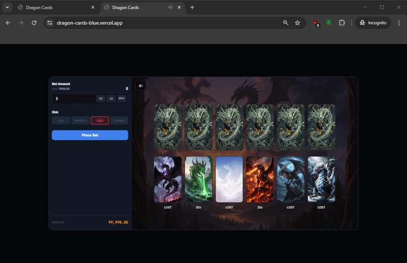

# Dragon Cards

A high-stakes iGaming card game built with a modern React stack. Experience a fantasy-themed risk/reward mechanic where strategy meets luck.

[**Play Live Demo**](https://dragon-cards-blue.vercel.app/)



## 🎮 Game Overview

Dragon Cards is a logic-based betting game. Players must arrange a set of dragon cards in the bottom row to match hidden cards in the top row. The outcome depends on the chosen risk level and the accuracy of the player's predictions.

## 🚀 Technical Stack

- **Framework:** React 19 + Vite
- **Language:** TypeScript (Strict mode)
- **State Management:** Zustand (with Persist middleware)
- **Styling:** CSS Modules & Variables (Dark Theme)
- **Animations:** - RequestAnimationFrame (rAF) for smooth balance counters.
    - CSS 3D Transforms for realistic card flips.
- **Audio:** Custom hook for game sound effects with global toggle.

## ✨ Key Features

- **Dynamic Risk System:** 4 risk levels (Low, Medium, High, Classic) with unique multiplier distributions and "LOST" card logic.
- **Interactive Mechanics:** Click-to-swap or Drag & Drop card positioning to define your strategy.
- **Real-time Game Logic:** Sequential card revealing with automated result calculation and payout management.
- **Smooth UX:**
    - Animated balance transitions.
    - Auto-closing result overlays with a "Quick Skip" feature.
    - LocalStorage persistence for user balance and settings.
- **Responsive Design:** Fully optimized for mobile (375px) and desktop (1440px+) environments.

## 🛠️ Installation & Setup

1. **Clone the repository:**
   `bash
    git clone [https://github.com/your-username/dragon-cards.git](https://github.com/your-username/dragon-cards.git)
    `
   Install dependencies:

```bash
npm install
```

Run development server:

```bash
npm run dev
Build for production:
```

```bash
npm run build
```
